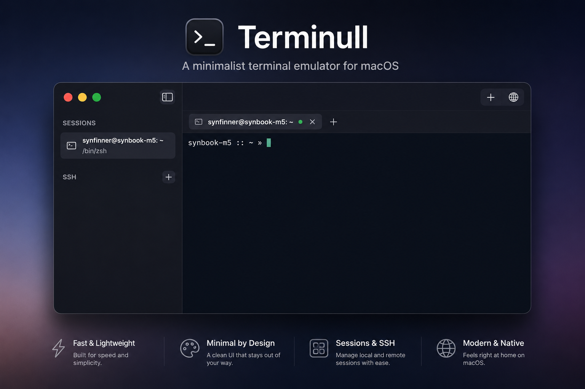

# Terminull



Terminull 0.1.1 is a minimal native macOS terminal emulator with saved SSH profiles, tabbed sessions, and Keychain-backed SSH key passphrase storage.

Terminull is an early preview release. It may contain bugs, incomplete behavior, or rough edges. Use it with care, especially when working in important local shells or remote SSH sessions.

The app is intentionally small:

- SwiftUI owns the window, sidebar, tabs, settings, and connection editor.
- SwiftTerm provides native AppKit terminal rendering and PTY-backed local processes.
- System OpenSSH handles SSH sessions, so standard terminal behavior stays familiar.
- SSH key passphrases are stored in the macOS Keychain and preloaded into `ssh-agent` before a saved SSH profile opens.

## Privacy

Terminull is built around local-first terminal behavior:

- No analytics.
- No trackers.
- No telemetry service.
- No bundled web views.
- No network calls except the terminal and SSH sessions the user starts.
- Saved SSH profiles stay in the user's Application Support directory.
- SSH key passphrases are stored in the macOS Keychain.

Terminull was built by synfinner. No tracking, no bs, just a terminal emulator with SSH management.

## No Warranty

Terminull is provided "as is", without warranty of any kind, express or implied, including but not limited to the warranties of merchantability, fitness for a particular purpose, and noninfringement.

To the maximum extent permitted by law, synfinner and contributors are not liable for any claim, damages, data loss, service interruption, lost profits, system damage, security incident, or other liability arising from, out of, or in connection with the app or the use of the app. You are responsible for reviewing, testing, and safely using Terminull in your own environment.

## Donate

Donations are accepted via Bitcoin and Bitcoin Lightning.

On-Chain address:

```text
bc1qqfrapakl4yceqs99k84j3tznjsa9c59mklvsvm
```

Lightning address:

```text
synfinner@cake.cash
```

## Run

```bash
./script/build_and_run.sh
```

## Verify

```bash
./script/build_and_run.sh --verify
```

## Release Build Notes

The local build script creates `dist/Terminull.app`, embeds version `0.1.1`, and signs the app bundle after resources are written. By default it uses ad-hoc signing for local verification.

```bash
./script/build_and_run.sh --package
```

This creates `dist/Terminull-0.1.1-macOS-preview.zip` and `dist/SHA256SUMS.txt`.

Preview GitHub builds are not Developer ID signed or notarized yet, so macOS Gatekeeper may block them by default. For public distribution with a smoother install path, set `CODE_SIGN_IDENTITY` to a Developer ID Application certificate and complete Apple notarization before shipping the artifact.
